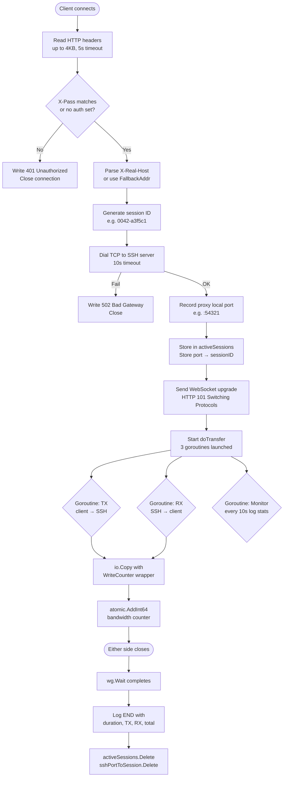
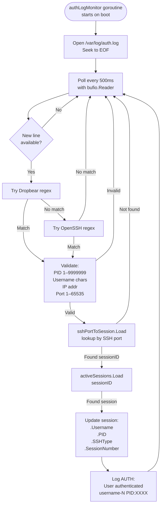
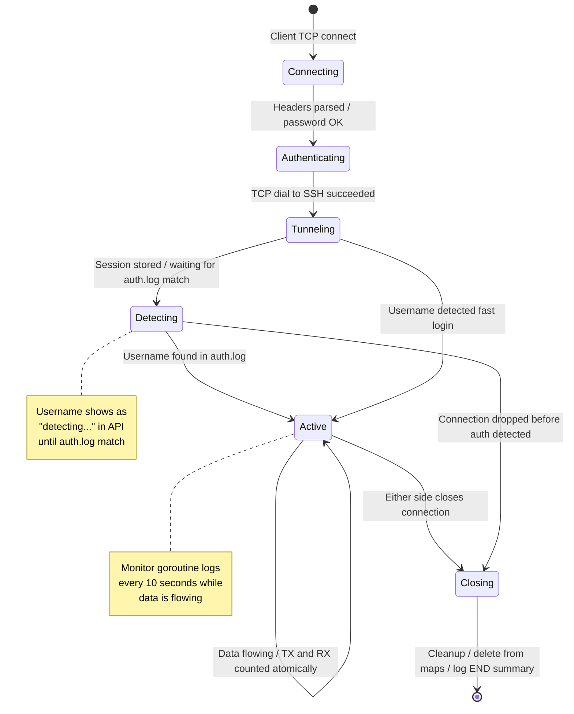
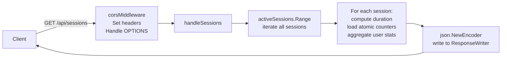
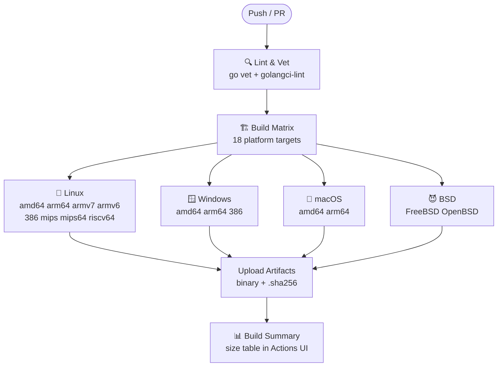
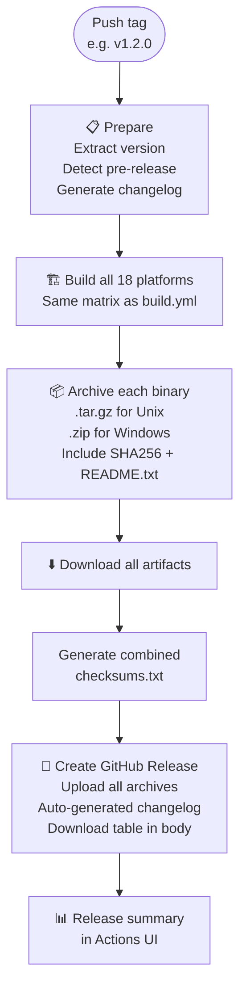

<div align="center">

# GO-TUNNEL PRO

**WebSocket-to-TCP Proxy · SSH Session Tracking · REST API · UDPGW**

[](LICENSE)
[](https://golang.org/)
[](../../releases)
[](../../actions/workflows/build.yml)
[](../../actions/workflows/release.yml)

*High-performance WebSocket proxy with real-time SSH user tracking, bandwidth monitoring, and a full JSON REST API — all in a single static binary.*

[Installation](#installation) · [Quick Start](#quick-start) · [Configuration](#configuration) · [Architecture](#architecture) · [API Reference](#api-reference) · [CI/CD](#cicd--release-pipeline) · [Security](#security)

</div>

---

## Table of Contents

- [Overview](#overview)
- [Features](#features)
- [Installation](#installation)
- [Quick Start](#quick-start)
- [Configuration](#configuration)
- [Architecture](#architecture)
  - [System Overview](#system-overview)
  - [Connection Flow](#connection-flow)
  - [Username Detection Flow](#username-detection-flow)
  - [Session Lifecycle](#session-lifecycle)
  - [API Request Flow](#api-request-flow)
- [How It Works (Deep Dive)](#how-it-works-deep-dive)
  - [1. WebSocket Proxy Core](#1-websocket-proxy-core)
  - [2. Port Correlation Mechanism](#2-port-correlation-mechanism)
  - [3. Auth Log Monitor](#3-auth-log-monitor)
  - [4. Bandwidth Tracking](#4-bandwidth-tracking)
  - [5. Session Manager](#5-session-manager)
  - [6. HTTP API Server](#6-http-api-server)
  - [7. UDPGW Multiplexer](#7-udpgw-multiplexer)
- [API Reference](#api-reference)
- [CI/CD & Release Pipeline](#cicd--release-pipeline)
- [Security](#security)
- [Performance](#performance)
- [Troubleshooting](#troubleshooting)
- [Contributing](#contributing)

---

## Overview

GO-TUNNEL PRO acts as a **WebSocket-to-TCP bridge**: it accepts incoming WebSocket connections (typically from SSH/VPN clients using WebSocket transport) and tunnels them to a real TCP service — most commonly an SSH server (Dropbear or OpenSSH).

What makes it unique is its **session intelligence layer**: by monitoring `/var/log/auth.log` in real time and correlating the proxy's ephemeral TCP port with SSH login events, it can automatically detect *which user* is behind each tunnel — without any changes to the SSH server.

```
Client ──[WebSocket]──▶ GO-TUNNEL PRO ──[TCP]──▶ SSH Server (port 22)
                              │
                    Reads /var/log/auth.log
                    Detects: username, PID
                    Exposes: REST API (port 8081)
```

---

## Features

### Core
- **WebSocket → TCP Tunneling** — bridge WebSocket clients to any TCP backend
- **Password Authentication** — optional per-connection auth via `X-Pass` header
- **Dynamic Target Routing** — per-connection SSH target via `X-Real-Host` header
- **Static Binary** — single file, no runtime dependencies, `CGO_ENABLED=0`

### Session Intelligence
- **Automatic Username Detection** — reads `/var/log/auth.log`, works with both Dropbear and OpenSSH
- **PID & Session Numbering** — track `john-1`, `john-2` for concurrent sessions from the same user
- **Port Correlation** — matches proxy ephemeral port to SSH auth log entry (no SSH server modifications needed)
- **Real-time Bandwidth** — per-session TX/RX with atomic counters (zero lock contention)

### REST API
- **6 JSON endpoints** — status, sessions, users, stats, health
- **Full CORS** — drop-in for web dashboards
- **Live data** — queries the in-memory session store directly

### Infrastructure
- **UDPGW (BadVPN)** — built-in UDP multiplexer on port 7300 for VPN UDP traffic
- **Graceful shutdown** — SIGTERM/SIGINT flushes active sessions and prints summary
- **Multi-output logging** — console + file, color-coded by level
- **CI/CD pipeline** — 18 platform targets, auto release with checksums

---

## Installation

### Requirements

| Requirement | Details |
|-------------|---------|
| OS | Linux (Debian 11+, Ubuntu 22.04+), macOS, FreeBSD |
| Go | 1.22.0 or higher |
| SSH Server | Dropbear **or** OpenSSH (for user detection) |
| Permissions | Read access to `/var/log/auth.log` |
| Ports | One port for proxy (default 8080), one for API (default 8081), 7300 for UDPGW |

### Download Pre-built Binary

```bash
# Linux amd64 (recommended)
VERSION=v1.2-Stable
curl -LO "https://github.com/risqinf/websocket-proxy/releases/download/${VERSION}/ssh-ws-${VERSION}-linux-amd64.tar.gz"
tar -xzf ssh-ws-${VERSION}-linux-amd64.tar.gz
chmod +x ssh-ws-${VERSION}-linux-amd64

# Verify checksum
sha256sum -c ssh-ws-${VERSION}-linux-amd64.sha256
```

### Build from Source

```bash
git clone https://github.com/risqinf/websocket-proxy.git
cd websocket-proxy

go mod init ssh-ws
go mod tidy

# Build (static + stripped)
CGO_ENABLED=0 go build \
  -trimpath \
  -ldflags "-s -w -X 'main.Version=v1.2-Stable' -X 'main.Credits=Risqi Nur Fadhilah'" \
  -o ssh-ws .

chmod +x ssh-ws
./ssh-ws --help
```

### Install as Systemd Service

```ini
# /etc/systemd/system/ssh-ws.service
[Unit]
Description=GO-TUNNEL PRO WebSocket Proxy
After=network.target
Wants=network-online.target

[Service]
Type=simple
User=nobody
Group=adm
WorkingDirectory=/opt/ssh-ws
ExecStart=/opt/ssh-ws/ssh-ws \
  -b 0.0.0.0 \
  -p 8080 \
  -t 127.0.0.1:22 \
  -a YOUR_PASSWORD \
  -l /var/log/ssh-ws.log \
  --auth-log /var/log/auth.log \
  --api-port 8081
Restart=always
RestartSec=5
LimitNOFILE=65536

[Install]
WantedBy=multi-user.target
```

```bash
sudo systemctl daemon-reload
sudo systemctl enable --now ssh-ws
sudo systemctl status ssh-ws
```

---

## Quick Start

```bash
# Minimal — listen on port 8080, forward to local SSH
./ssh-ws -p 8080

# With auth password and logging
./ssh-ws -p 8080 -a "s3cr3t" -l /var/log/ssh-ws.log

# Full production setup
./ssh-ws \
  -b 0.0.0.0 \
  -p 8080 \
  -t 127.0.0.1:22 \
  -a "$(cat /etc/ssh-ws/password)" \
  -l /var/log/ssh-ws.log \
  --auth-log /var/log/auth.log \
  --api-port 8081

# Disable API (monitoring not needed)
./ssh-ws -p 8080 --api-port 0
```

### Test a connection

```bash
# Simulate a WebSocket upgrade request
curl -i -N \
  -H "Connection: Upgrade" \
  -H "Upgrade: websocket" \
  -H "X-Pass: s3cr3t" \
  -H "X-Real-Host: 127.0.0.1:22" \
  http://localhost:8080/

# Check API
curl http://localhost:8081/api/status | jq
```

---

## Configuration

### Command-line Flags

| Flag | Default | Description |
|------|---------|-------------|
| `-b` | `0.0.0.0` | Bind address |
| `-p` | `8080` | WebSocket listener port |
| `-t` | `127.0.0.1:22` | Default SSH target (fallback if no `X-Real-Host`) |
| `-a` | *(none)* | Authentication password (optional) |
| `-l` / `--log` / `--logs` | *(console only)* | Log file path |
| `--auth-log` | `/var/log/auth.log` | SSH auth log path for username detection |
| `--api-port` | `8081` | HTTP API port (`0` = disabled) |

### Custom Headers (Client → Proxy)

| Header | Purpose | Example |
|--------|---------|---------|
| `X-Real-Host` | Override SSH target | `192.168.1.100:22` |
| `X-Pass` | Authentication | `mySecretPass` |

---

## Architecture

### System Overview

```
┌─────────────────────────────────────────────────────────────────────┐
│                         GO-TUNNEL PRO                               │
│                                                                     │
│   ┌───────────────┐   ┌────────────────┐   ┌─────────────────┐      │
│   │  WebSocket    │   │   UDPGW        │   │   HTTP API      │      │
│   │  Proxy Core   │   │   Service      │   │   Server        │      │
│   │  :8080        │   │   :7300        │   │   :8081         │      │
│   └──────┬────────┘   └────────────────┘   └────────┬────────┘      │
│          │                                           │              │
│   ┌──────▼───────────────────────────────────────────▼──────────┐   │
│   │                  Session Manager                            │   │
│   │   activeSessions   sync.Map  ─── sessionID → *SessionInfo   │   │
│   │   sshPortToSession sync.Map  ─── proxyPort  → sessionID     │   │
│   │   sessionCounter   int64     ─── atomic counter             │   │
│   └───────────────────────────────────┬──────────────────────────┘  │
│                                       │                             │
│   ┌───────────────────────────────────▼──────────────────────────┐  │
│   │              Auth Log Monitor                                │  │
│   │   Tails /var/log/auth.log at 500ms intervals                 │  │
│   │   Dropbear regex  ─── extracts PID, username, port           │  │
│   │   OpenSSH regex   ─── extracts PID, username, port           │  │
│   │   Strict validation ─ IP, port range, username chars         │  │
│   └──────────────────────────────────────────────────────────────┘  │
└─────────────────────────────────────────────────────────────────────┘
         │ TCP                                     │ JSON
         ▼                                         ▼
  ┌──────────────┐                        ┌──────────────────┐
  │  SSH Server  │                        │   Dashboard /    │
  │  Dropbear or │                        │   Monitoring     │
  │  OpenSSH     │                        │   Client         │
  └──────────────┘                        └──────────────────┘
```

---

### Connection Flow



---

### Username Detection Flow



---

### Session Lifecycle



---

### API Request Flow



---

## How It Works (Deep Dive)

### 1. WebSocket Proxy Core

When a client connects, the proxy reads the raw HTTP request (up to 4 KB, with a 5-second deadline). It never performs a proper WebSocket handshake validation — it only extracts two custom headers:

- **`X-Real-Host`**: the SSH server to connect to (e.g., `192.168.1.100:22`). Falls back to `-t` flag value.
- **`X-Pass`**: the password, compared against `-a` flag value. If auth is configured and the header is missing or wrong, the proxy returns `401` and closes.

Once auth passes, the proxy dials the target SSH server with a 10-second timeout and — if successful — immediately responds with:

```
HTTP/1.1 101 Switching Protocols
Upgrade: websocket
Connection: Upgrade

```

From this point, the TCP connection is **fully opaque** — the proxy just copies bytes in both directions using `io.Copy`. The SSH protocol flows through untouched.

### 2. Port Correlation Mechanism

This is the core of the username detection system. When the proxy dials out to the SSH server:

```
proxy:XXXXX  ──TCP──▶  ssh-server:22
```

The OS assigns an **ephemeral local port** to the proxy's outgoing connection (e.g., `:54321`). This same port is what the SSH server sees as the "client port" in the auth log:

```
dropbear[1234]: Password auth succeeded for 'john' from 127.0.0.1:54321
```

The proxy records this port (`proxyToSSHPort`) and stores the mapping:

```
sshPortToSession["54321"] = "0042-a3f5c1"
```

When `authLogMonitor` detects the log line, it extracts port `54321`, looks it up in the map, finds the session, and updates it with `john`, the PID, and the SSH type.

**This requires zero modifications to the SSH server.**

### 3. Auth Log Monitor

Runs in a dedicated goroutine, tailing `/var/log/auth.log` from the **end** (it seeks to EOF on startup so it ignores historical logins). It polls every 500ms using `bufio.Reader.ReadString('\n')`.

Two compiled regexes are matched per line:

**Dropbear pattern:**
```
^Month DD HH:MM:SS hostname dropbear[PID]: Password auth succeeded for 'USERNAME' from IP:PORT
```

**OpenSSH pattern:**
```
^Month DD HH:MM:SS hostname sshd[PID]: Accepted (password|publickey|keyboard-interactive) for USERNAME from IP port PORT ssh2
```

Every extracted value is strictly validated before use:
- PID: integer, range 1–9,999,999
- Username: 1–32 chars, valid POSIX charset
- IP: parsed by `net.ParseIP` (rejects malformed strings)
- Port: integer, range 1–65,535

### 4. Bandwidth Tracking

The proxy wraps `io.Writer` with a `WriteCounter` struct that intercepts every `Write` call and atomically increments a counter:

```go
type WriteCounter struct {
    Writer  io.Writer
    Counter *int64
}

func (wc WriteCounter) Write(p []byte) (int, error) {
    n, err := wc.Writer.Write(p)
    if n > 0 {
        atomic.AddInt64(wc.Counter, int64(n))  // lock-free
    }
    return n, err
}
```

`atomic.AddInt64` costs ~10ns vs ~100ns for a mutex. With high-throughput sessions, this matters. TX and RX are tracked independently per session. The monitor goroutine reads them every 10 seconds with `atomic.LoadInt64` (also lock-free).

### 5. Session Manager

Two `sync.Map` instances act as the in-memory state store:

```
activeSessions      : sessionID (string) → *SessionInfo
sshPortToSession    : proxyPort (string) → sessionID (string)
```

`sync.Map` is used instead of `map + sync.RWMutex` because the access pattern is mostly reads (API polling, monitor goroutine) with occasional writes (connect/disconnect). It's optimized exactly for this pattern.

Session IDs are generated as `{counter:04d}-{6hexchars}`, e.g. `0042-a3f5c1`. The counter prefix makes them sortable by creation order; the random suffix avoids collisions.

Session numbering per user (`john-1`, `john-2`) is computed by scanning `activeSessions` for the max existing number for that username and incrementing:

```go
func getNextSessionNumber(username string) int {
    maxNum := 0
    activeSessions.Range(func(_, value interface{}) bool {
        s := value.(*SessionInfo)
        if s.Username == username && s.SessionNumber > maxNum {
            maxNum = s.SessionNumber
        }
        return true
    })
    return maxNum + 1
}
```

### 6. HTTP API Server

Runs on a separate port (default 8081) with its own `http.ServeMux`. All handlers share a `corsMiddleware` wrapper that sets permissive CORS headers and short-circuits `OPTIONS` preflight requests.

All endpoints iterate `activeSessions.Range()` at query time — there is no separate data structure to maintain. Formatted values (human-readable bytes, duration strings) are computed on the fly, not stored.

**Bandwidth formatting:**
```
< 1024 B  → "512 B"
< 1 MB    → "1.0 KB"
< 1 GB    → "2.5 MB"
...
```

### 7. UDPGW Multiplexer

Runs as a goroutine on port 7300. It implements the [BadVPN UDPGW protocol](https://github.com/mukswilly/udpgw), which allows VPN clients that only have a TCP tunnel (through this proxy) to also route UDP traffic. The UDPGW service receives UDP-in-TCP frames from the client and relays them as real UDP datagrams.

---

## API Reference

**Base URL**: `http://<host>:8081`

All responses follow:
```json
{ "success": true, "data": { ... } }
```

### Endpoints

#### `GET /api/status`
Server uptime and session counters.

```json
{
  "success": true,
  "data": {
    "version": "v1.2-Stable",
    "uptime": "2h30m15s",
    "uptime_seconds": 9015,
    "total_sessions": 156,
    "active_sessions": 12,
    "closed_sessions": 144
  }
}
```

#### `GET /api/sessions`
All active sessions with full details + per-user aggregates.

```json
{
  "success": true,
  "data": {
    "total_sessions": 156,
    "active_sessions": 2,
    "closed_sessions": 154,
    "sessions": [
      {
        "id": "0042-a3f5c1",
        "real_client_ip": "203.0.113.45",
        "real_client_port": "54321",
        "username": "john",
        "session_number": 2,
        "pid": 12345,
        "ssh_type": "dropbear",
        "start_time": "2025-01-28T10:30:45Z",
        "tx_bytes": 1048576,
        "rx_bytes": 2097152,
        "duration": "15m30s",
        "tx_formatted": "1.0 MB",
        "rx_formatted": "2.0 MB",
        "total_formatted": "3.0 MB"
      }
    ],
    "user_stats": {
      "john": {
        "username": "john",
        "session_count": 2,
        "total_tx": 2097152,
        "total_rx": 4194304,
        "tx_formatted": "2.0 MB",
        "rx_formatted": "4.0 MB",
        "total_formatted": "6.0 MB"
      }
    }
  }
}
```

#### `GET /api/sessions/active`
Lightweight active session list (fewer fields, faster).

#### `GET /api/users`
Per-user bandwidth and session count aggregates.

#### `GET /api/stats`
Global bandwidth totals + user breakdown map.

```json
{
  "success": true,
  "data": {
    "uptime": "2h30m15s",
    "total_sessions": 156,
    "active_sessions": 12,
    "total_tx": 104857600,
    "total_rx": 209715200,
    "tx_formatted": "100.0 MB",
    "rx_formatted": "200.0 MB",
    "total_formatted": "300.0 MB",
    "unique_users": 3,
    "users_breakdown": { "john": 2, "alice": 3, "bob": 1 }
  }
}
```

#### `GET /health`
`{ "success": true, "message": "OK" }` — use for load balancer health checks.

---

### Client Examples

**JavaScript (polling dashboard)**
```javascript
setInterval(async () => {
  const res = await fetch('http://localhost:8081/api/sessions/active');
  const { data } = await res.json();
  data.sessions.forEach(s =>
    console.log(`${s.username}-${s.session_number}: ${s.total_formatted}`)
  );
}, 2000);
```

**Python**
```python
import requests, time

while True:
    data = requests.get('http://localhost:8081/api/stats').json()['data']
    print(f"{data['active_sessions']} sessions | {data['total_formatted']}")
    time.sleep(5)
```

**Bash**
```bash
watch -n 2 'curl -s http://localhost:8081/api/stats | jq ".data | {active:.active_sessions, total:.total_formatted}"'
```

---

## CI/CD & Release Pipeline

The repository includes two GitHub Actions workflows:

### Build Workflow (`.github/workflows/build.yml`)

Triggered on every push to `main`/`master`/`develop` and on pull requests.



**Build flags used:**
```bash
CGO_ENABLED=0 go build \
  -trimpath \
  -ldflags "-s -w \
    -X 'main.Version=${TAG}' \
    -X 'main.Credits=Risqi Nur Fadhilah' \
    -X 'main.BuildDate=${DATE}' \
    -X 'main.Commit=${SHA}'" \
  -o ssh-ws .
```

- `-s -w` strips DWARF debug info and symbol table → smaller binary
- `-trimpath` removes build host paths from binary → reproducible builds
- `CGO_ENABLED=0` → fully static, no glibc dependency
- `-X` → injects version metadata at link time

### Release Workflow (`.github/workflows/release.yml`)

Triggered automatically when a tag matching `v*.*.*` is pushed. Also supports manual dispatch.



**To trigger a release:**
```bash
git tag -a v1.3.0 -m "Release v1.3.0"
git push origin v1.3.0
```

**Pre-release detection** — tags containing `-alpha`, `-beta`, `-rc`, or `-dev` are automatically marked as pre-releases on GitHub.

---

## Security

### Authentication
The proxy supports optional password auth via `X-Pass` header. Without it, any client can connect.

**Recommended for production:**
```bash
# Store password in file, not shell history
echo "$(openssl rand -base64 32)" > /etc/ssh-ws/password
chmod 600 /etc/ssh-ws/password

./ssh-ws -a "$(cat /etc/ssh-ws/password)"
```

### API Security

The API has no built-in authentication. Before exposing to external networks:

1. **Restrict with firewall:**
   ```bash
   iptables -A INPUT -p tcp --dport 8081 -s 127.0.0.1 -j ACCEPT
   iptables -A INPUT -p tcp --dport 8081 -j DROP
   ```

2. **Use nginx reverse proxy with auth:**
   ```nginx
   location /api/ {
       auth_basic "Monitor";
       auth_basic_user_file /etc/nginx/.htpasswd;
       proxy_pass http://127.0.0.1:8081;
   }
   ```

3. **Use TLS for the proxy itself:**
   ```nginx
   server {
       listen 443 ssl;
       location / {
           proxy_pass http://127.0.0.1:8080;
           proxy_http_version 1.1;
           proxy_set_header Upgrade $http_upgrade;
           proxy_set_header Connection "upgrade";
       }
   }
   ```

### Input Validation

All data extracted from auth logs is strictly validated before use:
- Username: must match POSIX username charset (no path traversal, no shell metacharacters)
- IP: validated with `net.ParseIP` (not just regex)
- Port: enforced range 1–65535
- PID: enforced range 1–9,999,999

### Auth Log Permissions

```bash
# Add the service user to the adm group for auth.log read access
sudo usermod -aG adm ssh-ws-user

# Or explicitly:
sudo setfacl -m u:ssh-ws-user:r /var/log/auth.log
```

---

## Performance

| Metric | Value |
|--------|-------|
| Latency overhead | ~1–2 ms |
| Memory per session | ~1–2 KB |
| Base memory | ~10 MB |
| Bandwidth counter cost | ~10 ns (atomic) |
| Concurrent sessions tested | 1000+ |
| CPU at 100 sessions | < 5% (4-core) |
| Auth log poll interval | 500 ms |
| Monitor log interval | 10 s |

**Key optimizations:**
- `sync.Map` for concurrent session access (no global lock)
- `atomic.AddInt64` for bandwidth counters (no per-write lock)
- Regex compiled once at startup, reused across all log lines
- `io.Copy` for zero-copy byte forwarding (kernel buffer directly)
- One goroutine per connection (appropriate for long-lived SSH sessions)

---

## Troubleshooting

### Username shows "detecting..."

```bash
# 1. Verify auth.log is readable
ls -la /var/log/auth.log
# → should be readable by the process user

# 2. Check SSH is actually logging
tail -f /var/log/auth.log | grep -E 'dropbear|sshd'
# → should see lines on login

# 3. Test regex manually (Dropbear)
echo "Jan 28 10:30:45 srv dropbear[1234]: Password auth succeeded for 'test' from 1.2.3.4:5678" \
  | grep -P "dropbear\[\d+\]: Password auth succeeded"

# 4. Add user to adm group
sudo usermod -aG adm $USER
```

### API returns empty sessions

```bash
curl http://localhost:8081/api/status
# Check active_sessions field

# Verify proxy port is listening
netstat -tlnp | grep 8081
```

### Connection refused

```bash
# Check SSH server
systemctl status dropbear   # or ssh
ssh localhost -p 22

# Check proxy is running on expected port
netstat -tlnp | grep 8080
```

### Binary not found after build

```bash
# Confirm build succeeded
ls -lh dist/
file dist/ssh-ws-linux-amd64

# Check binary is static
ldd dist/ssh-ws-linux-amd64
# should print: not a dynamic executable
```

---

## Contributing

1. Fork the repository
2. Create a feature branch: `git checkout -b feat/my-feature`
3. Commit: `git commit -m 'feat: add my feature'`
4. Push: `git push origin feat/my-feature`
5. Open a Pull Request

**Commit message format**: `type: description`
Types: `feat`, `fix`, `perf`, `refactor`, `docs`, `test`, `chore`

---

## License

MIT License — see [LICENSE](LICENSE)

---

<div align="center">

**Developer**: [Risqi Nur Fadhilah](https://github.com/risqinf) · **Tester**: Rerechan02

*If this project helped you, please give it a ⭐*

</div>
